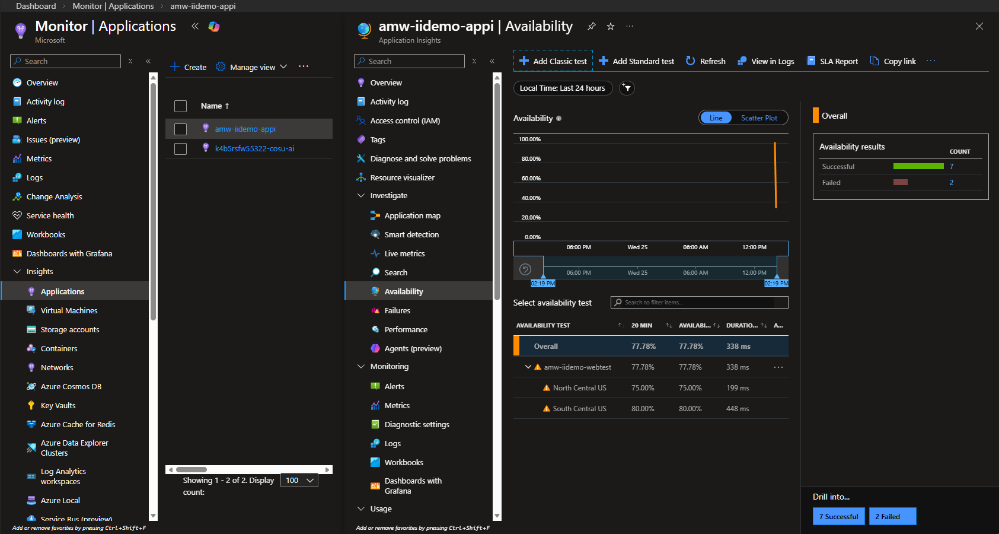
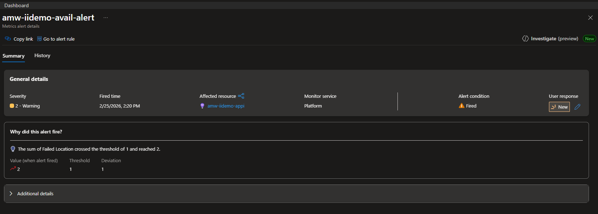
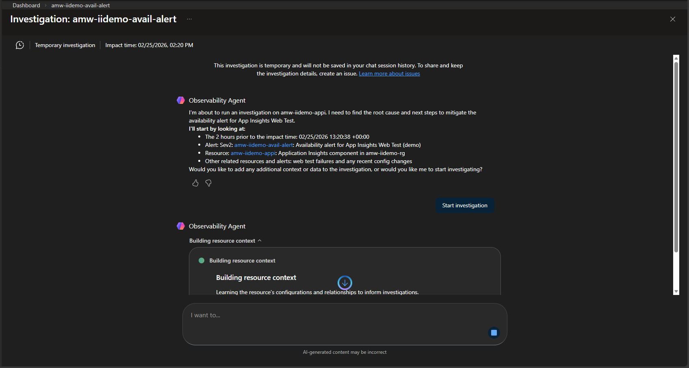
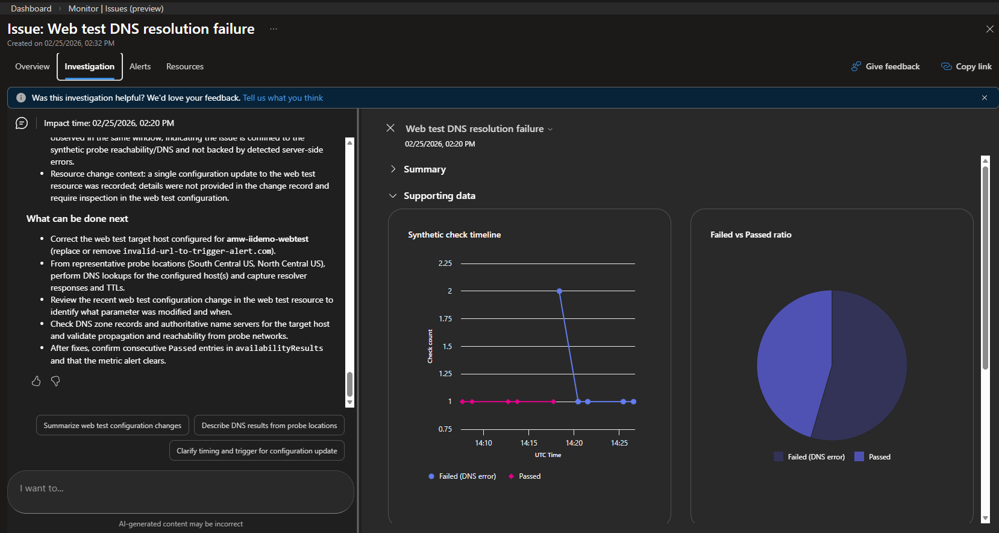
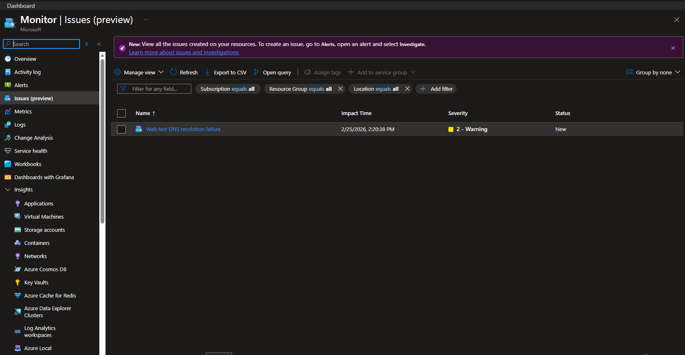

# Azure Monitor Workspace – Issues & Investigations Demo

A Terraform project that provisions a complete **Azure Monitor Workspace (AMW)** environment, wires it to a subscription as the default workspace, and demonstrates end-to-end **availability alerting** via Application Insights web tests. Designed as a self-contained demo for the *Issues & Investigations* feature (currently in preview).

---

## TL;DR

- Time/cost: deploys in minutes; small, pay-as-you-go demo footprint (LAW + App Insights + alert + web test).
- Run it now:

```bash
cp terraform.tfvars.example terraform.tfvars
# edit terraform.tfvars → set alert_email and webtest_url
terraform init && terraform apply
```

---

## Architecture

```
Subscription
└── Resource Group  (var.resource_group_name)
    ├── module: amw-subscription-association
    │   ├── Azure Monitor Workspace          (var.amw_name)
    │   ├── Subscription AMW association     (Microsoft.Monitor/settings/default)  [AzAPI]
    │   └── RBAC role assignment             (optional)
    └── module: availability-monitoring
        ├── Log Analytics Workspace          (var.law_name)
        ├── Application Insights (workspace) (var.appi_name)
        │   └── Web Test (classic ping)      (var.webtest_name)
        ├── Monitor Action Group             (var.action_group_name)
        └── Monitor Metric Alert (avail.)    (var.alert_name)
```

The **Azure Monitor Workspace** acts as the subscription-level default, which unlocks the *Issues & Investigations* blade in the Azure Portal. An Application Insights component runs a classic ping web test every **5 minutes** from two US geo-locations (the minimum interval Azure allows). When at least one location fails, a metric alert (evaluated every 1 min) fires and sends an email notification.

---

## Repository Structure

```
.
├── main.tf
├── variables.tf
├── outputs.tf
├── providers.tf
├── terraform.tfvars.example
├── .gitignore
├── README.md
├── assets/
│   └── screenshots/
├── tools/
│   ├── install-prerequisites.ps1        # Windows prerequisite installer (winget)
│   └── install-prerequisites.sh         # Linux / macOS prerequisite installer
└── modules/
    ├── amw-subscription-association/    # AMW + preview API subscription wiring
    └── availability-monitoring/         # LAW + APPI + Web Test + Alert stack
```

---

## What gets deployed

| # | Resource | Module |
|---|----------|--------|
| 1 | **Azure Monitor Workspace** | `amw-subscription-association` |
| 2 | **Subscription → AMW association** (preview API) | `amw-subscription-association` |
| 3 | **RBAC role assignment** *(optional)* | `amw-subscription-association` |
| 4 | **Log Analytics Workspace** | `availability-monitoring` |
| 5 | **Application Insights** (workspace-mode) | `availability-monitoring` |
| 6 | **Classic ping web test** (5 min, 2 US regions) | `availability-monitoring` |
| 7 | **Monitor Action Group** (email) | `availability-monitoring` |
| 8 | **Monitor Metric Alert** (≥ 1 location failed) | `availability-monitoring` |

---

## Prerequisites

| Requirement | Details |
|-------------|---------|
| Terraform | >= 1.3 |
| Azure CLI | Authenticated (`az login`) |
| Permissions | `Contributor` on the target subscription; `User Access Administrator` if `assign_amw_role = true` |

Helper scripts in `tools/` install Terraform and Azure CLI automatically:

```powershell
# Windows
.\tools\install-prerequisites.ps1
```

```bash
# Linux / macOS
bash tools/install-prerequisites.sh
```

---

## Variables

**Must change**

| Name | Type | Default | Description |
|------|------|---------|-------------|
| `alert_email` | `string` | `replace-me@example.com` | Notification email address |
| `webtest_url` | `string` | `https://www.microsoft.com` | URL probed by the web test |

**Defaults are usually fine**

| Name | Type | Default | Description |
|------|------|---------|-------------|
| `location` | `string` | `westeurope` | Azure region for all resources |
| `resource_group_name` | `string` | `amw-iidemo-rg` | Resource group name |
| `amw_name` | `string` | `amw-iidemo-amw` | Azure Monitor Workspace name |
| `law_name` | `string` | `amw-iidemo-law` | Log Analytics Workspace name |
| `appi_name` | `string` | `amw-iidemo-appi` | Application Insights name |
| `webtest_name` | `string` | `amw-iidemo-webtest` | Web test name |
| `action_group_name` | `string` | `amw-iidemo-ag` | Action Group name |
| `alert_name` | `string` | `amw-iidemo-avail-alert` | Metric alert name |
| `assign_amw_role` | `bool` | `true` | Assign an RBAC role on the AMW to the deploying principal |
| `amw_role_definition_name` | `string` | `Monitoring Contributor` | Role to assign (`Contributor`, `Monitoring Contributor`, or `Issue Contributor`) |

---

## Outputs

| Name | Description |
|------|-------------|
| `amw_id` | Azure Monitor Workspace resource ID |
| `amw_subscription_association_id` | Subscription-level AMW association resource ID |
| `application_insights_id` | Application Insights resource ID |
| `webtest_id` | Web test resource ID |
| `availability_alert_id` | Metric alert rule resource ID |

---

## Quick Start

Use the [TL;DR](#tldr) commands after setting the minimal `terraform.tfvars`:

```hcl
alert_email = "you@example.com"
webtest_url = "https://your-app.example.com"
```

---

## Demo Walkthrough

### 1 — Verify the AMW association

After `terraform apply`, go to **Monitor → Issues (preview)** in the Azure Portal. The blade opening confirms the subscription-level AMW association is active. A fresh deployment shows an empty issues list.


### 2 — Confirm availability data

Open your Application Insights resource → **Investigate → Availability**. Within ~5 minutes the web test chart shows 100% availability from both geo-locations.


### 3 — Trigger a failure

Set `webtest_url` to an unreachable address in `terraform.tfvars`, then re-apply:

```hcl
webtest_url = "https://this-does-not-exist.example.com"
```

After ~5 minutes the availability drops, the alert fires, and you receive an email notification.

> **Note:** The **"Investigate >"** button in the notification email leads to an older experience — use **"View the alert in Azure Monitor >"** instead.



### 4 — Create an investigation

1. Click **"View the alert in Azure Monitor >"** in the notification email to open the fired alert detail
2. Click **"Investigate (preview)"** in the top-right corner of the panel



3. The **Observability Agent** starts — click **"Start investigation"** to let it analyse correlated signals
4. The agent returns findings and auto-names the issue (e.g. *"Web test DNS resolution failure"*)
5. Explore the suggested follow-up prompts or type your own in the **"I want to..."** box

> **Note:** The agent is scoped to the historical window around the alert — it does not reflect the current live state.



6. The investigation is **temporary by default** — promote it to a tracked issue via the banner at the top


7. The **Investigation** tab shows agent findings, root cause, and suggested next steps



8. The issue is now also visible in **Monitor → Issues (preview)**



### 5 — Restore and clean up

Restore a valid URL in `terraform.tfvars` and re-apply. The metric alert **auto-resolves** after ~1–2 minutes. The **issue does not close automatically** — go to **Monitor → Issues (preview)**, open the issue, and click **"Mitigate issue"**.

To tear down all resources:

```bash
terraform destroy
```

> **Warning:** `terraform destroy` deletes the AMW and **all investigation history stored inside it is permanently lost**. Export any findings before running this.

---

## Notes

- The subscription AMW association uses the **preview API `2025-06-03-preview`** via `azapi_resource` (`Microsoft.Monitor/settings`), which is not yet supported by the `azurerm` provider.
- Web test geo-locations use classic internal codes (`us-tx-sn1-azr`, `us-il-ch1-azr`). Update `modules/availability-monitoring/main.tf` to change regions.
- A destroy-time provisioner calls `az rest --method DELETE` to remove the subscription association before Terraform deletes the AMW, preventing orphaned ARM state.
