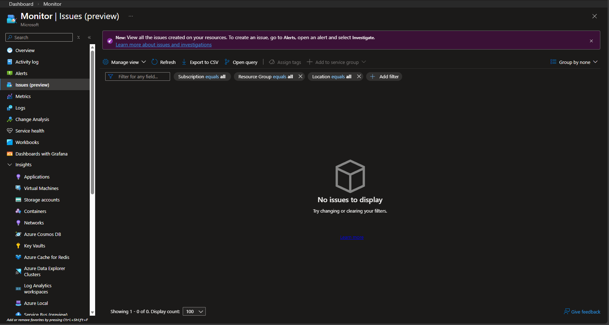
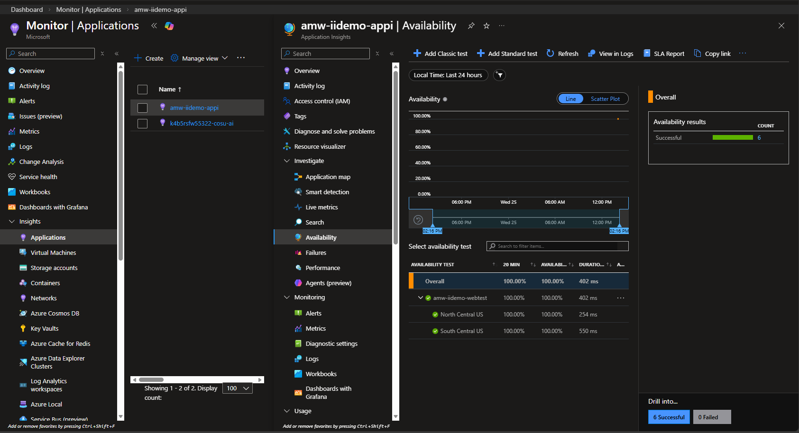
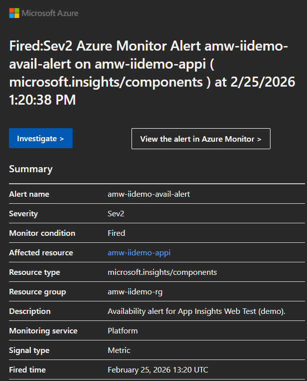
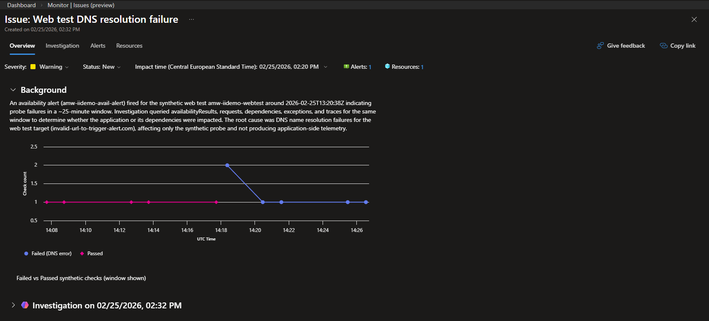

# Scenario: Availability URL Failure

Status: **Implemented** (default scenario).

## Goal

Trigger an Application Insights availability incident by pointing a classic ping web test at an unreachable URL. Then walk through the full **Issues & Investigations (preview)** workflow — from detection to AI-assisted root-cause analysis to recovery.

## Terraform selector

```hcl
enabled_scenarios = ["availability-url-failure"]
```

This scenario is enabled by default.

## What gets deployed

When selected, module `availability-monitoring` creates:

| # | Resource | Purpose |
|---|----------|---------|
| 1 | Application Insights (workspace-mode) | Linked to shared LAW |
| 2 | Classic ping web test | Probes target URL every 5 min from 2 US regions |
| 3 | Action Group (email) | Sends alert notification |
| 4 | Metric Alert (≥ 1 location failed) | Fires when availability drops |

## Demo Walkthrough

### Step 1 — Deploy the healthy baseline

Copy the example variables file and configure it:

```bash
cp terraform.tfvars.example terraform.tfvars
```

Edit `terraform.tfvars` — set the scenario, your email, and a valid URL:

```hcl
enabled_scenarios = ["availability-url-failure"]
alert_email       = "you@example.com"
webtest_url       = "https://www.microsoft.com"
```

Deploy:

```bash
terraform init
terraform apply
```

After deploy, wait **~5–10 minutes** for the web test to run a few successful cycles.

Verify there are no active issues in **Azure Portal → Monitor → Issues (preview)**:



Check the availability view in Application Insights to confirm tests are passing:



### Step 2 — Trigger the incident

Change the web test URL to an unreachable endpoint:

```hcl
webtest_url = "https://this-does-not-exist.example.com"
```

Apply:

```bash
terraform apply
```

This reconfigures the ping web test to probe a non-existent domain, causing all geo-locations to report failures.

### Step 3 — Observe the failure

Within **~5 minutes**, the web test begins reporting failures and the metric alert fires. You receive an email notification.

To view the alert details, either:
- Click the **View in Azure Monitor** link in the notification email, or
- Go to **Azure Portal → Monitor → Alerts**, filter by resource group `amw-iidemo-rg`, and click the fired alert




The alert detail page shows severity, description, affected scope and timestamps:


### Step 4 — Investigate with Issues & Investigations (preview)

From the fired alert detail page, click **Investigate (preview)** to open the Issues & Investigations blade.

Use the context-specific Copilot chat to analyse the issue:


Drill into **Issues (preview)** to view the issue context and affected resources:




Optionally, promote the temporary investigation to a tracked issue:


### Step 5 — Apply the fix

Restore a valid URL in `terraform.tfvars`:

```hcl
webtest_url = "https://www.microsoft.com"
```

Apply:

```bash
terraform apply
```

### Step 6 — Confirm recovery

After **~1–2 minutes**, the web test passes again and the alert auto-resolves. Manually mitigate or close the tracked issue in **Monitor → Issues (preview)** if you promoted one in Step 4.

## Key takeaways

- **Issues & Investigations (preview)** provides contextual correlation of alerts, affected resources and activity signals in a single view.
- The **Observability Agent** analyses the availability failure and provides root-cause context.
- The full cycle — detect → investigate → diagnose → fix → verify — is demonstrated end to end.
- This scenario is synthetic availability based; no custom application code is required.

## Notes

- This scenario reuses the shared Log Analytics Workspace defined by `law_name` in root config.
- Web test geo-locations use classic internal codes (`us-tx-sn1-azr`, `us-il-ch1-azr`). Update `modules/availability-monitoring/main.tf` to change regions.
- The "Investigate >" button in the notification email may point to an older flow; use **"View the alert in Azure Monitor >"** instead.
