# Scenario: VM Connectivity Loss

Status: **Implemented**.

## Goal

Demonstrate an infrastructure incident where a network misconfiguration (NSG deny rule) blocks the VM's outbound HTTPS connectivity to Azure Monitor, triggering an alert. Then walk through the full **Issues & Investigations (preview)** workflow — from detection to AI-assisted root-cause analysis to manual remediation.

## Terraform selector

```hcl
enabled_scenarios = ["vm-connectivity-loss"]
```

## What gets deployed

When selected, module `vm-connectivity-monitoring` creates:

| # | Resource | Purpose |
|---|----------|---------|
| 1 | Linux VM + VNet + Subnet + NSG | Demo infrastructure |
| 2 | Azure Monitor Agent (VM extension) | Sends monitoring data |
| 3 | Network Watcher Agent (VM extension) | Required for Connection Monitor |
| 4 | Data Collection Rule + association | Routes Heartbeat data to shared LAW |
| 5 | Connection Monitor | Tests TCP/443 to `global.handler.control.monitor.azure.com` every 60s |
| 6 | Metric Alert (`ChecksFailedPercent > 0`) | Fires when connectivity checks fail |
| 7 | Action Group (email) | Sends alert notification |

## Demo Walkthrough

### Step 1 — Deploy the healthy baseline

Copy the example variables file and configure it:

```bash
cp terraform.tfvars.example terraform.tfvars
```

Edit `terraform.tfvars` — set the scenario and your email, ensure the block is off:

```hcl
enabled_scenarios                  = ["vm-connectivity-loss"]
alert_email                        = "you@example.com"
vm_connectivity_block_outbound_443 = false
```

Deploy:

```bash
terraform init
terraform apply
```

After deploy, wait **~5–10 minutes** for the Connection Monitor to run a few successful test cycles.

To check the status, go to **Azure Portal → Network Watcher → Connection monitors** → click `amw-iidemo-vm-cm`. Once you see test results with **0% checks failed**, the baseline is healthy.

Verify the baseline is healthy:

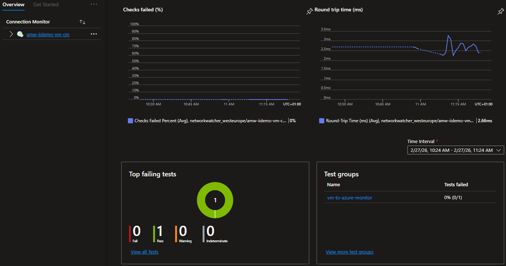

### Step 2 — Trigger the incident

Set the block variable to `true`:

```hcl
vm_connectivity_block_outbound_443 = true
```

Apply:

```bash
terraform apply
```

This adds an NSG outbound deny rule (`deny-outbound-https`, priority 200) blocking all TCP/443 egress from the VM, breaking the Connection Monitor's probe to Azure Monitor.

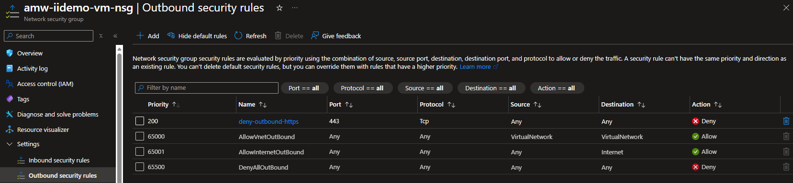

### Step 3 — Observe the failure

Within **~5–10 minutes**, the Connection Monitor begins reporting failed checks:

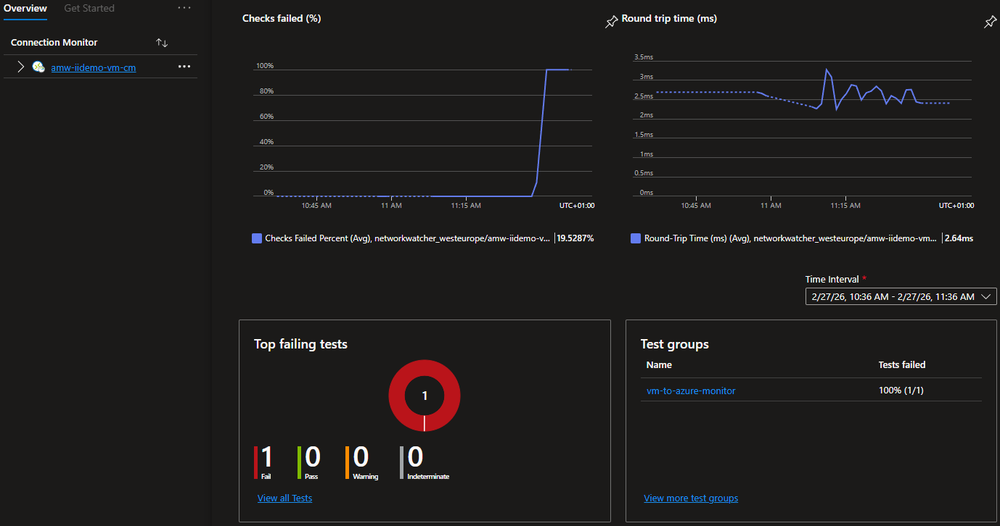

The metric alert fires and you receive an email notification.

To view the alert details, either:
- Click the **View in Azure Monitor** link in the notification email, or
- Go to **Azure Portal → Monitor → Alerts**, filter by resource group `amw-iidemo-rg`, and click the fired alert

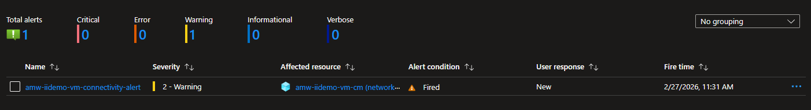

The alert detail page shows severity, description, affected scope and timestamps:

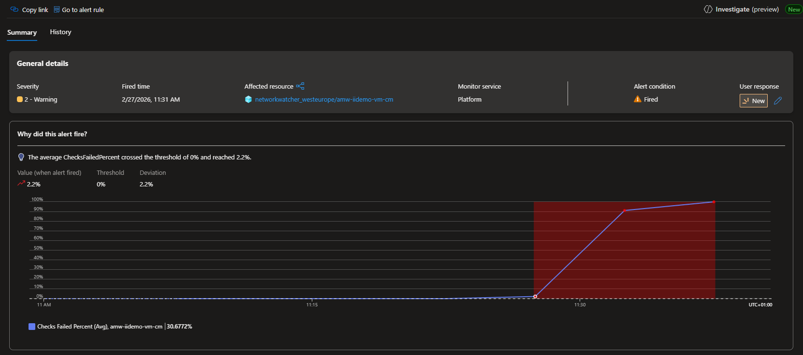

### Step 4 — Investigate with Issues & Investigations (preview)

From the fired alert detail page, click **Investigate (preview)** to open the Issues & Investigations blade:

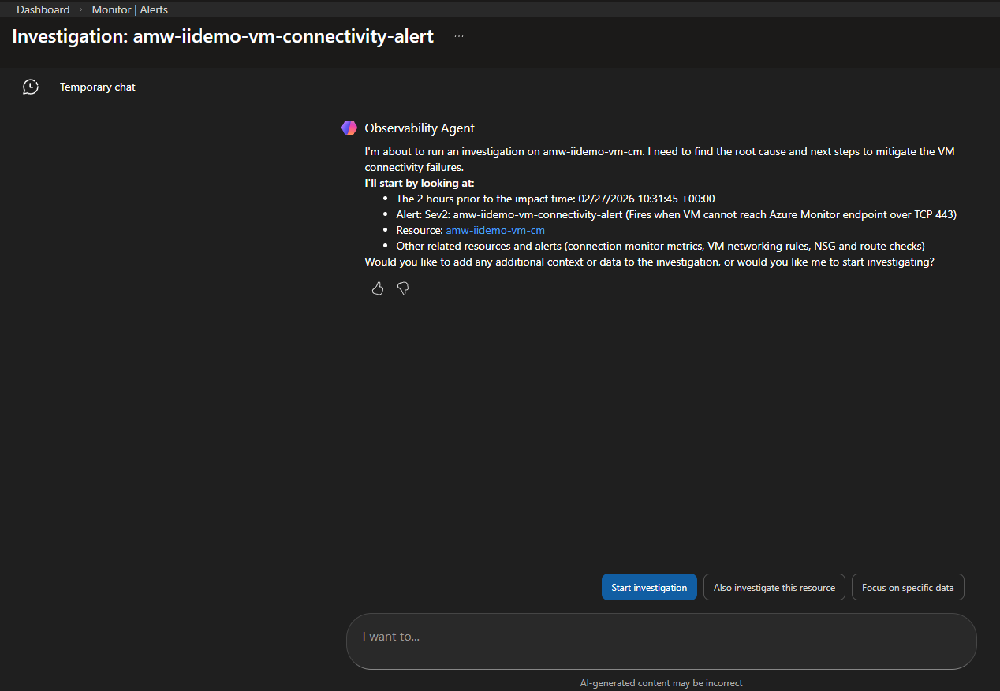

Drill into **Issues (preview)** to view the issue context, affected resources and correlated signals:

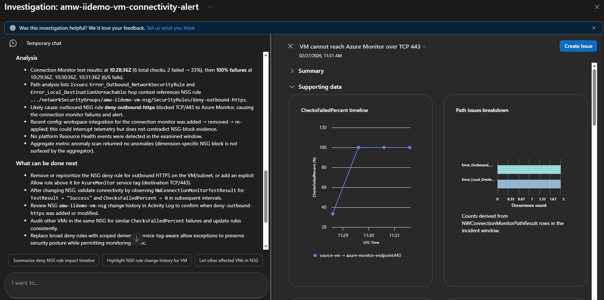

### Step 5 — AI-assisted root-cause analysis

Use the context-specific Copilot chat in the Investigation/Issue view. Ask a question like:

> *"What is causing this VM connectivity failure and how can I fix it?"*

The Observability Agent identifies the root cause (NSG deny rule) and provides the exact remediation steps:

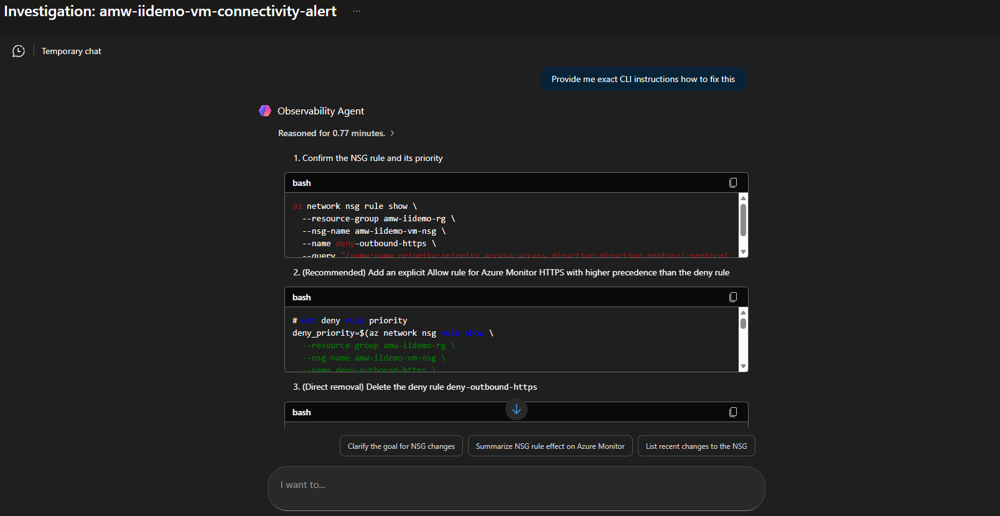

### Step 6 — Apply the fix (human in the loop)

Following the AI's recommendation, add an NSG allow rule with a higher priority (lower number) than the deny rule to restore Azure Monitor connectivity. Execute the remediation command in the Azure Portal Cloud Shell:

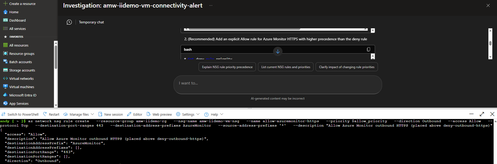

### Step 7 — Confirm recovery

After **~5–10 minutes**, the Connection Monitor reports healthy checks again:

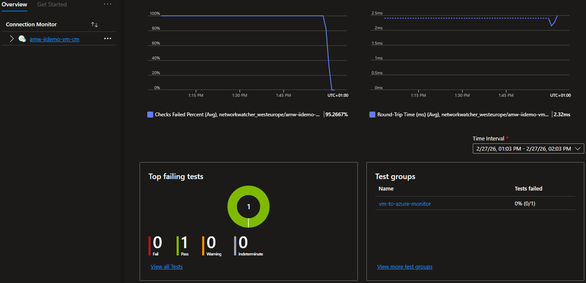

The metric alert auto-resolves:

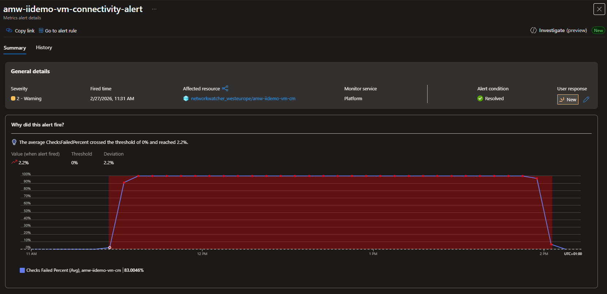

## Key takeaways

- **Issues & Investigations (preview)** provides contextual correlation of alerts, affected resources and activity signals in a single view.
- The **Observability Agent** correctly identifies the NSG deny rule as the root cause and provides actionable remediation steps.
- Remediation is **human-in-the-loop** — the AI advises, the operator approves and executes.
- The full cycle — detect → investigate → diagnose → fix → verify — is demonstrated end to end.

## Notes

- This scenario reuses the shared Log Analytics Workspace defined by `law_name` in root config.
- The NSG deny rule priority is set to 200, allowing a higher-priority allow rule to be inserted for remediation without deleting the deny rule.
- This scenario is infrastructure-only and does not require application code.
